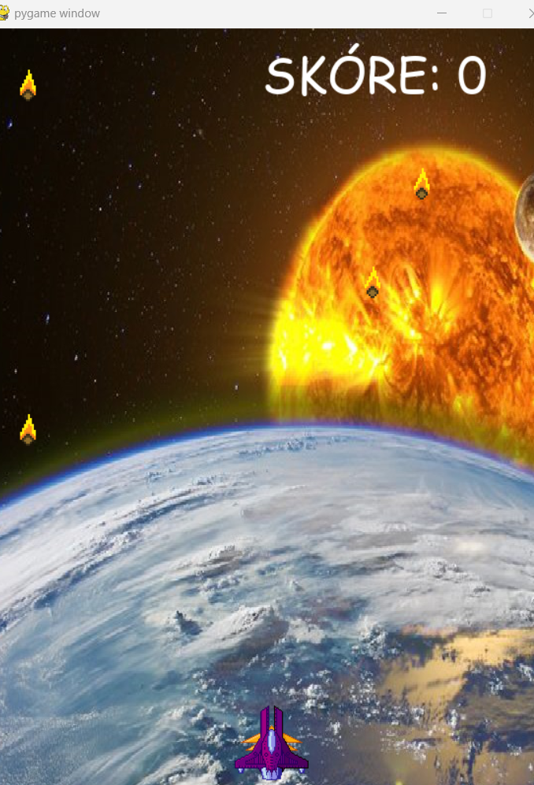

# Hra AVOID_METEORS

Hra avoid_meteors je stará klasická hra, pri ktorej sa pohybujú zhora smerom nadol náhodne generované meteory.
Najprv sú to napr. 4 meteory, potom 8, ďalej 12 atď. Na spodnej časti sa nachádza raketa, ktorú riadi hráč.
A to so šípkami do prava a do ľava. Cielom hry je vyhnuť sa meteorom. Za každý vyhnutý meteor je napr. 1 bod.
Po napr. každých dvoch vlnách meteorov sa objaví špec. obrázok, napr. (trojuholník), ktorý má extra hodnotu -
napr. 10 bodov. (Teda pri zrážke s raketou). Hra končí  pri prvej zrážke meteoru a rakety.

## Potrebné vedomosti
    1) Základný kurz pythonu
    2) Základné vedomosti o slovníkoch (dictionary)
    3) Modul random
    4) Modul pygame
    5) Práca s maskami v pygame

## Postup riešenia

Prečítajte si commity od 1 - 17. Sú vhodne popísané, čo sme v nich robili a ako sme postupne programovali hru. 

## Funkcie v kóde

Všetky funckie majú anglické pomenovania + parametre (deto). Pri volaní jednotlivých funkcii používame slovenské parametre, aby sme rozlišili tzv. lokálne a globálne premenné.

